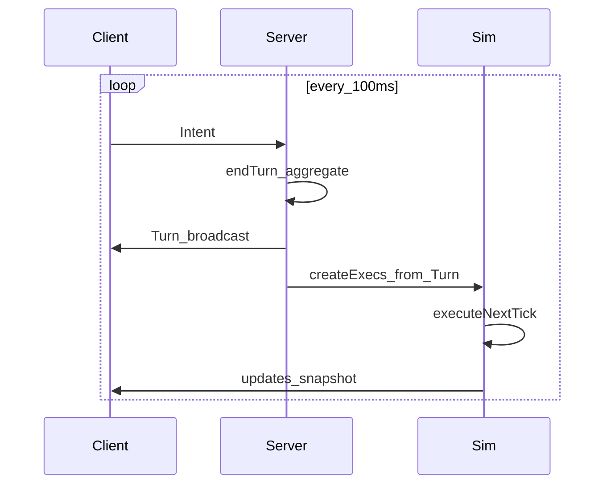

# ADR 001 — OpenFront-Style Tick / Intent / Execution

## Status

Accepted (design)

## Context

Starfall needs responsive orders (retarget/cancel within a fraction of a second) and a deterministic multiplayer sim for ~100 players. OpenFrontIO solved this with a lockstep **Intent → Turn → Execution → Tick** loop at **100ms**. We adopt that model rather than a coarse 1–2s “resolution tick” with a separate intent side-channel.

Reference: OpenFront `msPerTick()` / `turnIntervalMs()` = **100**, Intent/Execution pattern, `GameRunner.executeNextTick()`.

## Decision

### Time base

| Concept | Value | Notes |
|---|---|---|
| Tick | **100ms** | Smallest unit of game time; all state mutation happens in ticks |
| Turn interval | **100ms** | Server aggregates intents into one `Turn` per interval (same cadence as tick) |
| 1 second | **10 ticks** | Express durations as `seconds * 10` (OpenFront convention) |
| 20 minute round | **12_000 ticks** | `20 * 60 * 10` |

There is **no** separate slow economy tick. Economy, movement, builds, combat checks, and annexation all advance on the 100ms tick (some systems may only *fire* every N ticks using modulo, but the clock is unified).

### Loop (lockstep)



Per tick:

1. Take the next queued `Turn` (may be empty).
2. Convert each `StampedIntent` → `Execution` via `Executor` (invalid → `NoOpExecution` to preserve order).
3. `init()` new executions once.
4. Call `tick()` on every active execution (deterministic order).
5. Run built-in per-tick systems (economy pulse, win check) as ongoing executions or a fixed phase list.
6. Remove inactive executions.
7. Emit updates for clients / replay.

### Intent vs Execution

- **Intent** — immutable, serializable player wish (`MoveFleet`, `BuildShips`, `ResearchTech`, `CommitInvasion`, …). Clients send intents anytime; server stamps `clientId` and batches into the current turn.
- **Execution** — stateful object that mutates the game over one or many ticks. Can be cancelled by a later intent (e.g. `CancelMove`).

```ts
interface Execution {
  init(game: Game, tick: Tick): void;
  tick(game: Game, tick: Tick): void;
  isActive(): boolean;
}
```

### Execution kinds (Starfall)

| Kind | Examples | Duration |
|---|---|---|
| Instant | UpgradeNode, ResearchTech, ProposeAlliance, AcceptAlliance, BreakAlliance, BuildShips (queue + pay) | Completes in `init` or first `tick` |
| Multi-tick | MoveFleet (lane transit), CargoShip (auto to homeworld), BuildProgress (shipyard), Invasion escort in transit | Active until done or cancelled |
| Instant combat | Lanchester resolve when hostile fleets share a node/lane after movement this tick | One-shot execution spawned by contact detection |
| Ongoing | EconomyExecution, WinCheckExecution | Active for whole match |

**Research** is instant: pay credits and add to `player.researched` on the purchase turn (OpenFront-style instant execution). Effects (speed, garrison, vision, unlocks) apply from the next relevant calculation that tick onward.

**Combat remains instant on contact** (Starfall rule, not OpenFront tile attrition). Multi-tick skill comes from movement/orders, not prolonged battles. Reinforcements that arrive on a later tick fight in a new engagement.

### Same-turn intent rules

- Multiple intents in one turn from one client: process in stamp/sequence order.
- Conflicting moves on the same `fleetId`: later intent wins (replace execution).
- Attack/move ratio style aggregation is unnecessary for discrete fleets; use last-write-wins + cancel intents.

### Determinism

- Same turn stream ⇒ same state (replay / late join / desync debug).
- Seeded PRNG in game state only; no wall-clock in sim.
- Execution list order is stable (add order + stable sort by id when needed).
- Combat float → ship conversion uses documented floor rules.

### Intra-tick phase order (within `executeNextTick`)

1. Attach new executions from this turn’s intents  
2. Tick multi-tick movement / build executions  
3. Detect contacts → spawn combat executions → resolve instantly  
4. Annexation checks  
5. Economy / score / win (or as ongoing execs at end)

## Consequences

- Actions feel as fast as OpenFront (~100ms turn latency), not 1s+.
- Balance tables use ticks (`seconds * 10`); see [balance.md](../design/balance.md).
- Server is primarily a **turn broadcaster** + optional authority; sim must be pure/deterministic for lockstep clients (authoritative server may still run the only sim — see ADR 002).
- Supersedes earlier drafts that used 1s or 2s “resolution ticks” with a decoupled intent channel.

## References

- OpenFrontIO: `msPerTick` 100, `turnIntervalMs` 100, Intent/Execution docs
- [mechanics.md](../design/mechanics.md)
- [tech-tree.md](../design/tech-tree.md)
- [domain.md](../design/domain.md)
- [002-multiplayer-architecture.md](./002-multiplayer-architecture.md)
