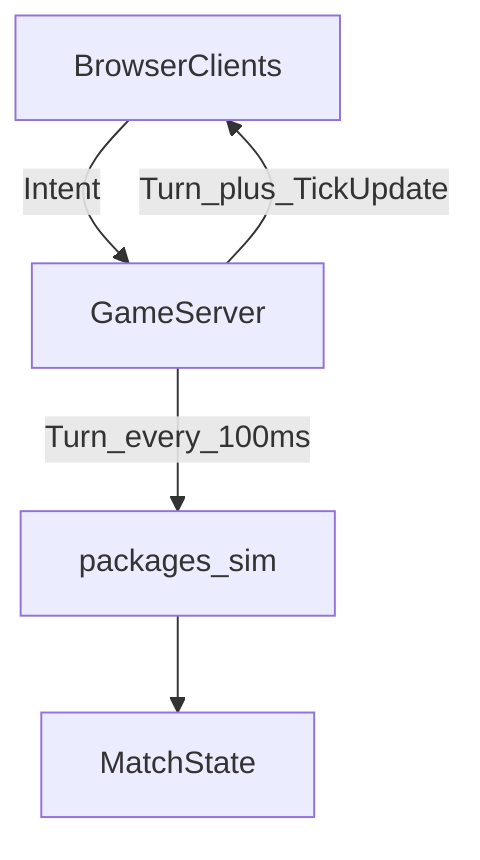

# ADR 002 — TypeScript Multiplayer Architecture (OpenFront Lockstep)

## Status

Accepted (vision) — not implemented yet

## Context

Starfall follows OpenFront’s networking shape: clients submit **intents**; the server ends a **turn** every **100ms**, stamps intents, and broadcasts the turn so the simulation advances in lockstep. Stack: **TypeScript** monorepo with a pure `packages/sim`.

## Decision

### Monorepo

```text
starfall/
  packages/
    sim/       # pure TS: Executor, Execution, executeNextTick — no I/O
    server/    # WebSocket GameServer: intent ingest, endTurn, broadcast
  apps/
    web/       # map UI; sends intents; renders snapshots / local view
  docs/
```

### Authority model (v1 skeleton)

**Authoritative server sim** (simpler than full client lockstep at first):

1. Client → `Intent` messages (anytime).
2. Server buffers intents until `turnIntervalMs` (100ms).
3. Server `endTurn()`: build `Turn { turnNumber, intents: StampedIntent[] }`, archive for replay/late join.
4. Server runs `createExecs(turn)` + `executeNextTick()` on the authoritative `Game`.
5. Server → clients: `Turn` (for replay/transparency) + `TickUpdate` (deltas / fogged view).

Full client-side lockstep (every client also runs `executeNextTick` on the same turns) is compatible with this wire format and can be added later for CPU offload / instant local feel; v1 does not require it.



### Wire messages

| Message | Direction | Role |
|---|---|---|
| `Intent` | C→S | Player action; schema-validated |
| `Turn` | S→C | `{ turnNumber, intents }` for the closed interval |
| `TickUpdate` | S→C | Fogged entity deltas, events (combat, capture), scores |
| `MatchOver` | S→C | Winner / final standings |
| `Hello` / lobby | both | Join, seat, map hash |

Clients include a monotonic `sequence` on intents for stable ordering within a turn.

### Scale (50–100 FFA)

| Concern | Approach |
|---|---|
| Match size | One match ≈ one Node process; ~250 nodes in memory |
| Tick budget | 100ms wall budget; keep `executeNextTick` well under that |
| Bandwidth | Fogged deltas; don’t broadcast full state every tick |
| Turn archive | Keep turns[] for late join / replay |
| Out of scope | Redis match state, cross-region migrate, spectator CDN |

### Security

- Stamp `clientId` server-side; never trust client identity fields inside intents.
- Validate intents when creating executions (`init`); bad intents → `NoOpExecution`.
- Vision filter on `TickUpdate` only; sim may be omniscient.

### Package boundary

`packages/sim` must not import Node net/fs or DOM. Balance loaded as data into `Config` (`msPerTick(): 100`).

## Consequences

- Matches OpenFront’s mental model: intents are cheap and frequent; ticks are 100ms; durations use `* 10` for seconds.
- First code milestone: `packages/sim` with Executor + golden combat tests, driven by recorded `Turn[]` (no net).
- Second: `packages/server` turn loop + thin web client.

## Non-goals (skeleton)

- Redis-backed match state
- Mobile-native clients
- Tile-attrition combat (Starfall keeps instant Lanchester)

## References

- [001-tick-engine.md](./001-tick-engine.md)
- [domain.md](../design/domain.md)
- [roadmap.md](../roadmap.md)
- OpenFrontIO `GameServer` turn interval / intent stamping
